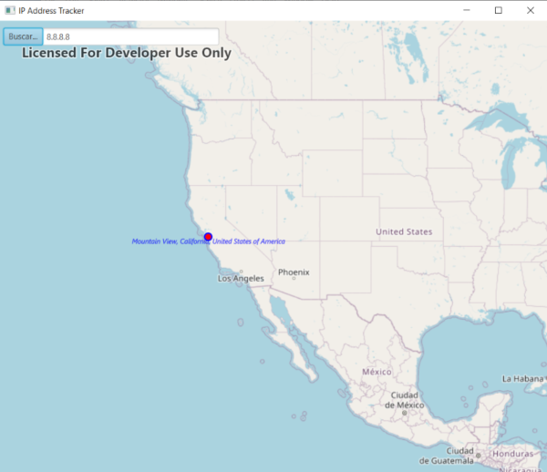

# IP Address Tracker
This project is based on [java-gradle-starter-project](https://github.com/Esri/java-gradle-starter-project "java-gradle-starter-project")  and uses the ArcGIS runtime SDK for java 
with Gradle. It also uses IP geolocation web service IP2Location ™ and java Gson library.

The project includes the Gradle wrapper, so there is no need to install Gradle to run the app.

The application launches a window that shows a map, a text field and a button, which allow the user to consult an IP address, obtain information such as the country, region, city, latitude, longitude, and view the location on the map. 

## Instructions

### IntelliJ IDEA

1. Open IntelliJ IDEA and select _File > Open..._.
2. Choose the java-gradle-starter-project directory and click _OK_.
3. Select _File > Project Structure..._ and ensure that the Project SDK and language level are set to use Java 11.
4. Open the Gradle view with _View > Tool Windows > Gradle_.
5. In the Gradle view, double-click `copyNatives` under _Tasks > build_. This will unpack the native library dependencies to $USER_HOME/.arcgis.
6. In the Gradle view, double-click `run` under _Tasks > application_ to run the app.

### Eclipse

1. Open Eclipse and select _File > Import_.
2. In the import wizard, choose _Gradle > Existing Gradle Project_, then click _Next_.
3. Select the java-gradle-starter-project directory as the project root directory.
4. Click _Finish_ to complete the import.
5. Select _Project > Properties_ . In _Java Build Path_, ensure that under the Libraries tab, _Modulepath_ is set to JRE System Library (JavaSE-11). In _Java Compiler_, ensure that the _Use compliance from execution environment 'JavaSE-11' on the 'Java Build Path'_ checkbox is selected.
6. Right-click the project in the Project Explorer or Package Explorer and choose _Gradle > Refresh Gradle project_.
7. Open the Gradle Tasks view with _Window > Show View > Other... > Gradle > Gradle Tasks_.
8. In the Gradle Tasks view, double-click `copyNatives` under _java-gradle-starter-project > build_. This will unpack the native library dependencies to $USER_HOME/.arcgis.
9. In the Gradle Tasks view, double-click `run` under _java-gradle-starter-project > application_ to run the app.

### Command Line

1. `cd` into the project's root directory.
2. Run `./gradlew clean build` on Linux/Mac or `gradlew.bat clean build` on Windows.
3. Run `./gradlew copyNatives` on Linux/Mac or `gradlew.bat copyNatives` on Windows. This will unpack the native library dependencies to $USER_HOME.arcgis.
3. Run `./gradlew run` on Linux/Mac or `gradlew.bat run` on Windows to run the app.

## Requirements

See the Runtime SDK's [system requirements](https://developers.arcgis.com/java/latest/guide/system-requirements.htm).

## Resources

* [ArcGIS Runtime SDK for Java](https://developers.arcgis.com/java/)  
* [ArcGIS Blog](https://blogs.esri.com/esri/arcgis/)  
* [Esri Twitter](https://twitter.com/esri)  
* [IP2Location™ IP Geolocation Web Service](https://www.ip2location.com/web-service/ip2location)
* [Gson](https://github.com/google/gson)

## Issues

Find a bug or want to request a new feature?  Please let us know by submitting an issue.

## Contributing

Please refer to each project's style and contribution guidelines for submitting patches and additions. In general, we follow the "fork-and-pull" Git workflow.

1. Fork the repo on GitHub
2. Clone the project to your own machine
3. Commit changes to your own branch
4. Push your work back up to your fork
5. Submit a Pull request so that we can review your changes
6. NOTE: Be sure to merge the latest from "upstream" before making a pull request!

## Licensing

Copyright 2019 Esri

Licensed under the Apache License, Version 2.0 (the "License"); you may not 
use this file except in compliance with the License. You may obtain a copy 
of the License at

http://www.apache.org/licenses/LICENSE-2.0

Unless required by applicable law or agreed to in writing, software 
distributed under the License is distributed on an "AS IS" BASIS, WITHOUT 
WARRANTIES OR CONDITIONS OF ANY KIND, either express or implied. See the 
License for the specific language governing permissions and limitations 
under the License.

A copy of the license is available in the repository's license.txt file.
